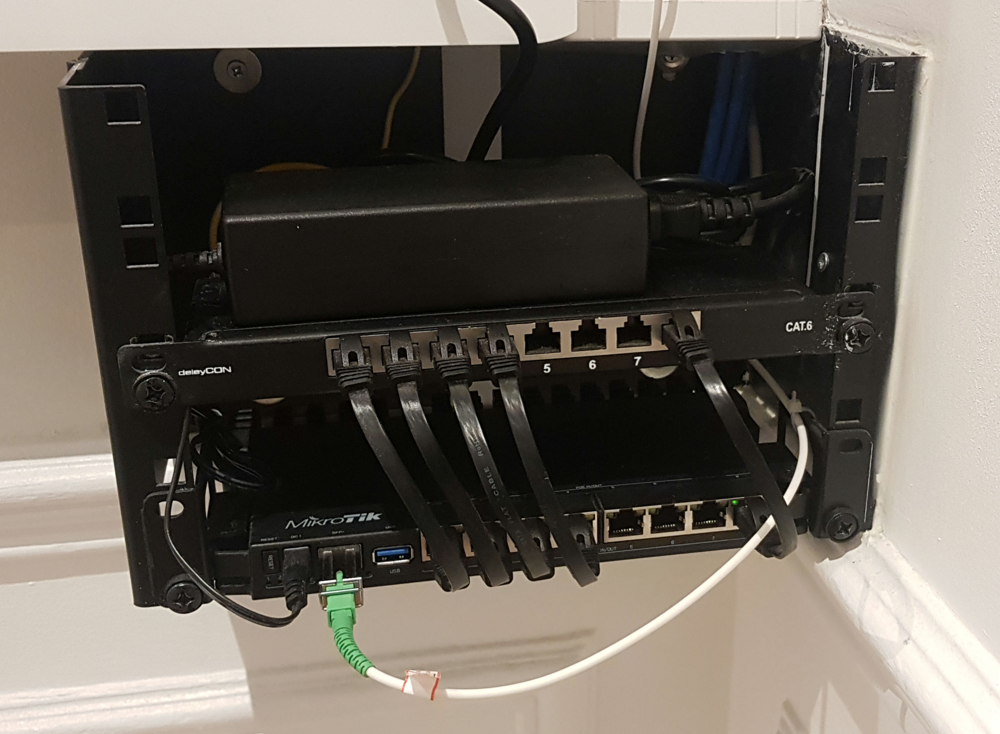
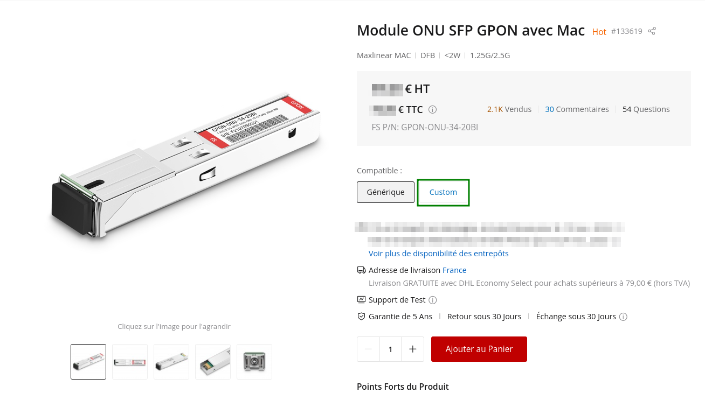
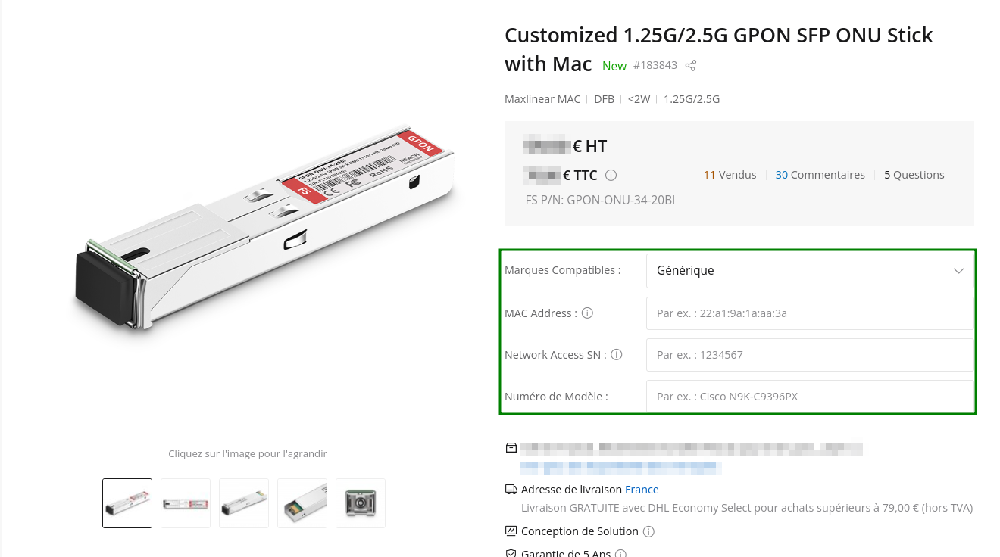

# Remplacement d'une Livebox Orange/Sosh Fibre par un routeur Mikrotik RB5009UPr+S+IN et une borne wifi cAP

> :information_source:
> This documentation will not be translated into English because the configuration is too local-specific.

Cette documentation décrit la procédure de remplacement d'une Livebox V4 Orange/Sosh Fibre par un routeur Mikrotik RB5009UPr+S+IN et un module fibre GPON-ONU-34-20BI. La configuration IPv4 et IPv6 est décrite.
Cette documentation décrit une configuration avec un point d'accès wifi Mikrotik cAP ax, alimenté directement en "power-over-ethernet" (PoE) sur l'interface ether8 du routeur Mikrotik RB5009. Bien sûr, si vous n'utilisez pas le point d'accès wifi Mikrotik cAP ax, vous devrez adapter la configuration du routeur Mikrotik RB5009UPr+S+IN, et notamment probablement la configuration du PoE sur l'interface ether8.

> :information_source:
> Vous pouvez tenter d'adapter la documentation pour d'autres modèles de routeurs Mikrotik et d'autres Livebox.

<!-- markdownlint-disable MD028 -->
> :warning:
> La configuration finale ne permet pas d'utiliser la téléphonie fixe.

<!-- markdownlint-disable MD028 -->
> :warning:
> La configuration finale ne permet pas d'utiliser la télévision par internet. Une configuration supplémentaire non décrite dans cette documentation est nécessaire.

## Sommaire

* [1. Matériel](#hw)
* [2. Configuration Optique](#optical)
* [3. Configuration Mikrotik](#conf)
  * [3.1. Prérequis pour les options DHCP](#dhcp)
  * [3.2. Configuration du routeur Mikrotik RB5009](#router)
  * [3.3. Configuration du point d'accès wifi Mikrotik cAP ax](#ap)

## <a name="hw">1. Matériel</a>

L'installation est composée des éléments suivants:

- Support Mural Panneau de Brassage. Pour ma part, j'avais acheté en promo [ce rack 19"](https://www.amazon.fr/gp/product/B00066HSAI) et je l'avais coupé derrière au milieu avec une disqueuse pour qu'il fasse 10". L'idée c'est quand même de pas payer ça trop cher...
- [Panneau de brassage 10"](https://www.amazon.fr/gp/product/B07DCQW6RM)
- Rackmount kit [Mikrotik K-79](https://mikrotik.com/product/rb5009_mount)
- Routeur [Mikrotik RB5009UPr+S+IN](https://mikrotik.com/product/rb5009upr_s_in)
- Interface optique [GPON-ONU-34-20BI](https://www.fs.com/fr/products/133619.html)
- Point d'accès Wifi [Mikrotik cAP ax](https://mikrotik.com/product/cap_ax) (absent de la photo car fixé au plafond)
- Des [câbles plats](https://fr.aliexpress.com/item/1005003995751089.html) parce que pour une si petite distance ça n'a pas d'incidence qu'ils soient plats



## <a name="optical">2. Configuration Optique</a>

Après avoir un peu galéré à me connecter en SSH sur l'interface optique pour changer le Serial Number, je viens de découvrir qu'il est possible de carrément le spécifier dans le formulaire lors de la commande:




## <a name="conf">3. Configuration Mikrotik</a>

|Équipement|Dernière version RouterOS testée|
|:---:|:---:|
|RB5009|7.16.2|
|cAP ax|7.17.2|

### <a name="dhcp">3.1. Prérequis pour les options DHCP</a>

Vous allez avoir besoin de convertir des valeurs ASCII en valeurs hexadécimales (et aussi inversement si vous êtes curieux), notamment pour vos identifiants de connexion, informations qui vous sont strictement confidentielles.

Je vous déconseille formellement d'utiliser des services en ligne tiers pour faire ça. Je vous conseille plutôt de définir les fonctions bash suivantes sur votre ordinateur personnel (en supposant que vous utilisez Linux):

```bash
function ascii2hex() {
    (
        if [ $# == 0 ]; then
            cat </dev/stdin
        else
            echo -n "$1"
        fi
    ) | tr -d "\n" | xxd -p -c 256
}
function hex2ascii() {
    (
        if [ $# == 0 ]; then
            cat </dev/stdin
        else
            echo -n "$1"
        fi
    ) | tr -d "\n" | xxd -p -r
    echo
}
```

Exemple avec une valeur hexadécimale:

```bash
$ ascii2hex sagem
736167656d
# or equivalent
$ echo sagem | ascii2hex
736167656d
```

Rajouter 0x devant la valeur :

```none
/ip dhcp-client option add code=60 name=vendorclass value=0x736167656d
```

Exemple avec une valeur ASCII:

```bash
$ hex2ascii 0x736167656d
sagem
# or equivalent
$ echo sagem | ascii2hex | hex2ascii
sagem
```

Rajouter des guillemets simples et doubles autours de la valeur :

```none
/ip dhcp-client option add code=60 name=vendorclass value="'sagem'"
```

> :information_source:
> Je ne vous recommande pas d'écrire les options en ASCII dans la configuration Mikrotik...

### <a name="router">3.2. Configuration du routeur Mikrotik RB5009</a>

Dans la configuration ci-après, remplacer les valeurs suivantes:

- `my-hostname` par le hostname souhaité

- `333` par le port SSH d'administration souhaité

- `my-username` et `my-password` pour l'utilisateur système

- `AA:BB:CC:DD:EE:FF` par l'adresse MAC de l'interface principale (en général ether2, sur ce modèle c'est ether2 systématiquement)

Vous pouvez obtenir directement l'adresse mac de cette interface ether2 à l'aide de la commande suivante:

```none
:put ([:pick [/interface/ethernet/ print detail as-value where default-name="ether2"] 0]->"orig-mac-address")
```

- Si vous possédez un autre modèle de Livebox, remplacer `0x002b46535644534c5f6c697665626f782e496e7465726e65742e736f66746174686f6d652e4c697665626f7834` dans la valeur de l'option DHCP (option DHCPv4 90 et DHCPv6 11) par la bonne valeur:

```none
$ hex2ascii 0x002b46535644534c5f6c697665626f782e496e7465726e65742e736f66746174686f6d652e4c697665626f7834
"'+FSVDSL_livebox.Internet.softathome.Livebox4'"
```

- Dans un terminal, saisir les commandes suivantes, en mettant bien un espace devant, afin que la commande ne soit pas visible dans l'historique:
<!-- markdownlint-disable MD014 -->
```bash
$  login="fti/my-login"
$  password="my-password"
```

Puis continuer avec les commandes suivantes et remplacer 0xXXXXXXXXXXX dans la configuration par la valeur obtenue :

```bash
$ salt="$(cat /dev/urandom | tr -dc "a-f0-9" | fold -w 16 | head -n 1)"
$ echo "0x00000000000000000000001a0900000558010341010d$(ascii2hex "$login")3c12$(ascii2hex "$salt")0313$(ascii2hex "${salt:0:1}")$(echo -n "${salt:0:1}${password}${salt}" | md5sum | awk '{print $1}' )"
```

Configuration finale sans les remplacements :

<a name="router-conf"></a>

```none
/interface bridge
add admin-mac=AA:BB:CC:DD:EE:FF auto-mac=no comment=defconf name=bridge-lan port-cost-mode=short
add name=bridge-wan port-cost-mode=short protocol-mode=none
/interface ethernet
set [ find default-name=ether1 ] poe-out=off
set [ find default-name=ether2 ] poe-out=off
set [ find default-name=ether3 ] poe-out=off
set [ find default-name=ether4 ] poe-out=off
set [ find default-name=ether5 ] disabled=yes poe-out=off
set [ find default-name=ether6 ] disabled=yes poe-out=off
set [ find default-name=ether7 ] disabled=yes poe-out=off
set [ find default-name=sfp-sfpplus1 ] auto-negotiation=no speed=2.5G-baseT
/interface vlan
add interface=sfp-sfpplus1 name=vlan832-orange-internet vlan-id=832
/interface list
add comment=defconf name=WAN
add comment=defconf name=LAN
/ip dhcp-client option
add code=60 name=vendorclass value=0x736167656d
add code=77 name=userclass value=0x002b46535644534c5f6c697665626f782e496e7465726e65742e736f66746174686f6d652e4c697665626f7834
add code=90 name=authsend value=0xXXXXXXXXXXX
/ip ipsec proposal
set [ find default=yes ] disabled=yes
/ip pool
add name=dhcp_pool1 ranges=192.168.88.11-192.168.88.254
/ip dhcp-server
add address-pool=dhcp_pool1 interface=bridge-lan name=dhcpv4
/ip smb users
set [ find default=yes ] disabled=yes
/ipv6 dhcp-client option
add code=6 name=request value=0x000b001100170018
add code=11 name=auth value=0xXXXXXXXXXXX
add code=15 name=userclass value=0x002b46535644534c5f6c697665626f782e496e7465726e65742e736f66746174686f6d652e4c697665626f7834
add code=16 name=classidentifier value=0x0000040e0005736167656d
/ip smb
set enabled=no
/interface bridge filter
add action=set-priority chain=output dst-port=547 ip-protocol=udp mac-protocol=ipv6 new-priority=6 out-interface=vlan832-orange-internet
add action=set-priority chain=output dst-port=67 ip-protocol=udp mac-protocol=ip new-priority=6 out-interface=vlan832-orange-internet
/interface bridge port
add bridge=bridge-lan comment=defconf interface=ether2
add bridge=bridge-lan comment=defconf interface=ether3
add bridge=bridge-lan comment=defconf interface=ether4
add bridge=bridge-lan comment=defconf interface=ether5
add bridge=bridge-lan comment=defconf interface=ether6
add bridge=bridge-lan comment=defconf interface=ether7
add bridge=bridge-lan comment=defconf interface=ether8
add bridge=bridge-lan interface=ether1
add bridge=bridge-wan interface=vlan832-orange-internet
/ip firewall connection tracking
set udp-timeout=10s
/ip neighbor discovery-settings
set discover-interface-list=LAN
/ipv6 settings
set accept-router-advertisements=yes
/interface list member
add comment=defconf interface=bridge-lan list=LAN
add interface=bridge-wan list=WAN
add interface=sfp-sfpplus1 list=WAN
/ip address
add address=192.168.88.1/24 comment=defconf interface=bridge-lan network=192.168.88.0
/ip dhcp-client
add disabled=yes interface=ether1
add dhcp-options=vendorclass,userclass,authsend,clientid interface=bridge-wan
/ip dhcp-server network
add address=192.168.88.0/24 comment=defconf dns-server=192.168.88.1 gateway=192.168.88.1
/ip dns
set allow-remote-requests=yes
/ip dns static
add address=192.168.88.1 comment=defconf name=router.lan type=A
/ip firewall filter
add action=drop chain=input comment="drop invalid input" connection-state=invalid
add action=drop chain=forward comment="drop invalid forward" connection-state=invalid
add action=drop chain=forward comment="drop all from WAN not DSTNATed" connection-nat-state=!dstnat connection-state=new in-interface-list=!LAN
add action=drop chain=forward comment="force LAN to use the router as DNS server" dst-address-list="" dst-port=53 in-interface-list=LAN log=yes protocol=udp
add action=accept chain=input comment="accept established,related input" connection-state=established,related
add action=accept chain=forward comment="accept established,related forward" connection-state=established,related
add action=accept chain=input comment="accept outgoing traffic input" in-interface-list=LAN
add action=accept chain=forward comment="accept outgoing traffic forward" in-interface-list=LAN
add action=accept chain=input comment="defconf: accept to local loopback (for CAPsMAN)" disabled=yes dst-address=127.0.0.1
add action=accept chain=forward comment="defconf: accept in ipsec policy" disabled=yes ipsec-policy=in,ipsec
add action=accept chain=forward comment="defconf: accept out ipsec policy" disabled=yes ipsec-policy=out,ipsec
add action=accept chain=input comment="accept icmp input" protocol=icmp
add action=accept chain=input comment="accept dns input" dst-port=53 in-interface=bridge-wan protocol=udp
add action=accept chain=input comment="accept dhcp input" dst-port=67 in-interface=bridge-wan protocol=udp
add action=accept chain=input comment="accept ntp input" dst-port=123 in-interface=bridge-wan protocol=udp
add action=drop chain=input comment="Drop everything else input"
add action=drop chain=forward comment="Drop everything else forward"
/ip firewall nat
add action=masquerade chain=srcnat comment="defconf: masquerade" disabled=yes ipsec-policy=out,none out-interface-list=WAN
add action=masquerade chain=srcnat out-interface=bridge-wan src-address=192.168.88.0/24
/ip hotspot service-port
set ftp disabled=yes
/ip ipsec policy
set 0 disabled=yes
/ip ipsec profile
set [ find default=yes ] dpd-interval=2m dpd-maximum-failures=5
/ip route
add disabled=yes distance=1 dst-address=0.0.0.0/0 gateway=192.168.1.1 pref-src="" routing-table=main scope=30 suppress-hw-offload=no target-scope=10
/ip service
set telnet address=192.168.88.0/24 disabled=yes
set ftp address=192.168.88.0/24 disabled=yes
set www address=192.168.88.0/24 disabled=yes
set ssh address=192.168.88.0/24 port=333
set www-ssl address=192.168.88.0/24
set api address=192.168.88.0/24 disabled=yes
set winbox address=192.168.88.0/24
set api-ssl address=192.168.88.0/24 disabled=yes
/ip smb shares
set [ find default=yes ] directory=/pub
/ipv6 address
add address=::1 from-pool=pool_FT_6 interface=bridge-lan
/ipv6 dhcp-client
add add-default-route=yes dhcp-options=auth,classidentifier,userclass dhcp-options=auth,classidentifier,userclass interface=vlan832-orange-internet pool-name=pool_FT_6 request=prefix
/ipv6 firewall address-list
add address=::/128 comment="defconf: unspecified address" list=bad_ipv6
add address=::1/128 comment="defconf: lo" list=bad_ipv6
add address=fec0::/10 comment="defconf: site-local" list=bad_ipv6
add address=::ffff:0.0.0.0/96 comment="defconf: ipv4-mapped" list=bad_ipv6
add address=::/96 comment="defconf: ipv4 compat" list=bad_ipv6
add address=100::/64 comment="defconf: discard only " list=bad_ipv6
add address=2001:db8::/32 comment="defconf: documentation" list=bad_ipv6
add address=2001:10::/28 comment="defconf: ORCHID" list=bad_ipv6
add address=3ffe::/16 comment="defconf: 6bone" list=bad_ipv6
/ipv6 firewall filter
add action=drop chain=input comment="drop invalid input" connection-state=invalid
add action=drop chain=forward comment="drop invalid forward" connection-state=invalid
add action=drop chain=forward comment="defconf: drop packets with bad src ipv6 forward" src-address-list=bad_ipv6
add action=drop chain=forward comment="defconf: drop packets with bad dst ipv6 forward" dst-address-list=bad_ipv6
add action=drop chain=forward comment="defconf: rfc4890 drop hop-limit=1" hop-limit=equal:1 protocol=icmpv6
add action=accept chain=input comment="accept established,related,untracked input" connection-state=established,related,untracked
add action=accept chain=forward comment="accept established,related,untracked forward" connection-state=established,related,untracked
add action=accept chain=input comment="accept outgoing traffic input" in-interface-list=LAN
add action=accept chain=forward comment="accept outgoing traffic forward" in-interface-list=LAN
add action=accept chain=forward comment="defconf: accept ICMPv6" disabled=yes protocol=icmpv6
add action=accept chain=input comment="accept ICMPv6 input" protocol=icmpv6
add action=accept chain=input comment="accept UDP traceroute input" port=33434-33534 protocol=udp
add action=accept chain=input comment="accept dhcp input" dst-port=546 in-interface=bridge-wan protocol=udp src-address=fe80::ba0:bab/128
add action=accept chain=input comment="accept DHCPv6-Client prefix delegation input" dst-port=546 in-interface=bridge-wan protocol=udp src-address=fe80::/10
add action=accept chain=input comment="defconf: accept IKE" disabled=yes dst-port=500,4500 protocol=udp
add action=accept chain=input comment="defconf: accept ipsec AH" disabled=yes protocol=ipsec-ah
add action=accept chain=input comment="defconf: accept ipsec ESP" disabled=yes protocol=ipsec-esp
add action=accept chain=input comment="defconf: accept all that matches ipsec policy" disabled=yes ipsec-policy=in,ipsec
add action=accept chain=forward comment="defconf: accept all that matches ipsec policy" disabled=yes ipsec-policy=in,ipsec
add action=accept chain=forward comment="defconf: accept HIP" disabled=yes protocol=139
add action=accept chain=forward comment="defconf: accept IKE" disabled=yes dst-port=500,4500 protocol=udp
add action=accept chain=forward comment="defconf: accept ipsec AH" disabled=yes protocol=ipsec-ah
add action=accept chain=forward comment="defconf: accept ipsec ESP" disabled=yes protocol=ipsec-esp
add action=drop chain=input comment="Drop everything else input"
add action=drop chain=forward comment="Drop everything else forward"
/system clock
set time-zone-name=Europe/Paris
/system identity
set name=my-hostname
/system leds
set 0 disabled=yes
/system leds settings
set all-leds-off=immediate
/system note
set show-at-login=no
/tool mac-server
set allowed-interface-list=LAN
/tool mac-server mac-winbox
set allowed-interface-list=LAN
/user settings
set minimum-categories=3 minimum-password-length=12
/user/add name=my-username group=full address=192.168.88.0/24 password="my-password"
/user/remove default
```

### <a name="ap">3.3. Configuration du point d'accès wifi Mikrotik cAP ax</a>

Dans la configuration ci-après, remplacer les valeurs suivantes:

- `my-hostname` par le hostname souhaité

- `my-username` et `my-password` pour l'utilisateur système

- `my-ssid` et `my-ssid-5-ghz` pour les SSID des réseaux Wifi respectifs 2.5 GHz et 5 GHz. Il est recommandé de ne pas mettre les mêmes SSID

> :information_source:
> Cette configuration contient un cron journalier pour éteindre les 2 radios wifi la nuit: voir sections `/system script` et `/system scheduler` pour adapter les configurations.

<a name="ap-conf"></a>

```none
/interface bridge
add name=bridge1 port-cost-mode=short
/interface ethernet
set [ find default-name=ether2 ] disabled=yes
/interface wifi
set [ find default-name=wifi1 ] comment="5 GHz" configuration.country=France .mode=ap .ssid="my-ssid-5-ghz" security.authentication-types=wpa2-psk,wpa3-psk
set [ find default-name=wifi2 ] comment="2.5 GHz" configuration.country=France .mode=ap .ssid="my-ssid" disabled=no security.authentication-types=wpa2-psk,wpa3-psk
/ip smb users
set [ find default=yes ] disabled=yes
/interface bridge port
add bridge=bridge1 interface=ether1
add bridge=bridge1 interface=ether2
add bridge=bridge1 interface=wifi1
add bridge=bridge1 interface=wifi2
/ip firewall connection tracking
set udp-timeout=10s
/ipv6 settings
set disable-ipv6=yes
/ip address
add address=192.168.88.1/24 comment="default configuration" disabled=yes interface=ether1 network=192.168.88.0
add address=192.168.88.2/24 interface=bridge1 network=192.168.88.0
/ip dhcp-relay
add dhcp-server=192.168.88.1 disabled=no interface=bridge1 name=relay1
/ip dns
set servers=192.168.88.1
/ip ipsec profile
set [ find default=yes ] dpd-interval=2m dpd-maximum-failures=5
/ip route
add disabled=no dst-address=0.0.0.0/0 gateway=192.168.88.1 routing-table=main suppress-hw-offload=no
/ip service
set telnet address=192.168.88.0/24 disabled=yes
set ftp address=192.168.88.0/24 disabled=yes
set www address=192.168.88.0/24 disabled=yes
set ssh address=192.168.88.0/24 port=333
set www-ssl address=192.168.88.0/24
set api address=192.168.88.0/24 disabled=yes
set winbox address=192.168.88.0/24
set api-ssl address=192.168.88.0/24 disabled=yes
/ip smb shares
set [ find default=yes ] directory=/pub
/system clock
set time-zone-name=Europe/Paris
/system identity
set name=my-hostname
/system leds
set 0 disabled=yes
/system leds settings
set all-leds-off=immediate
/system note
set show-at-login=no
/system script
add dont-require-permissions=no name=disable-wifi owner=my-username policy=write source="/interface disable wifi1\r\
    \n/interface disable wifi2"
add dont-require-permissions=no name=enable-wifi2 owner=my-username policy=write source="/interface enable wifi2"
add dont-require-permissions=no name=enable-wifi1 owner=my-username policy=write source="/interface enable wifi1"
/system scheduler
add interval=1d name="disable wifi" on-event=disable-wifi policy=write start-date=2023-06-14 start-time=00:30:00
add disabled=yes interval=1d name="enable wifi 1" on-event=enable-wifi1 policy=write start-date=2023-06-14 start-time=07:15:00
add interval=1d name="enable wifi 2" on-event=enable-wifi2 policy=write start-date=2023-06-14 start-time=07:45:00
add disabled=yes name="enable wifi 1 at boot" on-event=enable-wifi1 policy=write start-time=startup
add name="enable wifi 2 at boot" on-event=enable-wifi2 policy=write start-time=startup
/user settings
set minimum-categories=3 minimum-password-length=12
/user/add name=my-username group=full address=192.168.88.0/24 password="my-password"
/user/remove default
```
